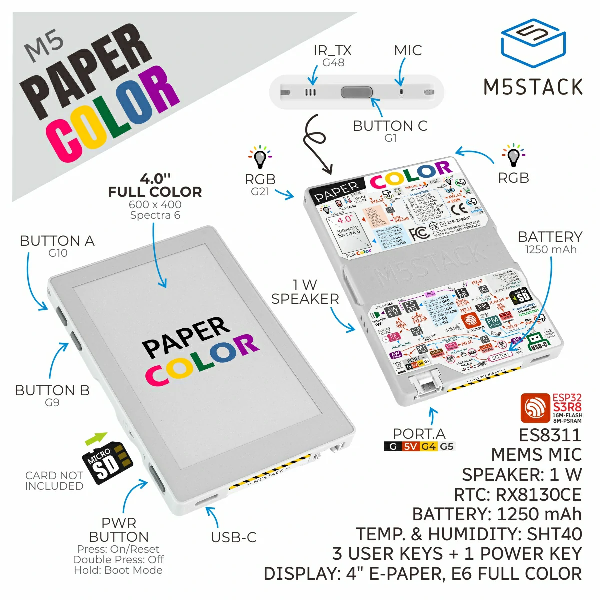

# M5Stack PaperColor Device Status Dashboard

[中文说明](README.zh-CN.md)

A standalone device-status dashboard for the **M5Stack PaperColor**, built with PlatformIO. It shows essential device, power, storage, sensor, clock, and network information on the 4-inch E-Ink display.



## About M5Stack PaperColor

M5Stack PaperColor is a portable full-colour E-Ink device based on Espressif's ESP32-S3R8. Its low-power display and integrated peripherals make it well suited to information dashboards and battery-powered embedded projects.

| Component | Specification |
| --- | --- |
| MCU | ESP32-S3R8, 16 MB Flash and 8 MB PSRAM |
| Display | 4.0-inch ED2208 E-Ink, 400 × 600, Spectra 6 full colour |
| Storage | microSD card slot |
| Sensors / PMIC | SHT40, RX8130CE RTC, M5PM1 |
| Audio | ES8311 codec, MEMS microphone, 1 W speaker |
| Power / input | 1,250 mAh battery, USB-C, buttons A/B/C and power key |

See the [official M5Stack PaperColor documentation](https://docs.m5stack.com/en/core/PaperColor) for full hardware details and pin information.

## Features

- Overview: model, ESP32-S3 resources, SDK, CPU frequency, heap and PSRAM.
- Power: battery percentage and voltage, USB and charging state.
- Storage: microSD capacity, used/free space and a bounded file scan.
- Environment: SHT40 temperature and relative humidity.
- Clock and network: RX8130 RTC time, Wi-Fi MAC and wake-up count.
- PaperColor-appropriate 400 × 600 layout, refreshed at boot and then every five minutes.
- BtnA/B requests a refresh; BtnC enters a safe power-off sequence.
- RTC recovery calibrates from the firmware build timestamp once per new flash when valid time is lost.

## Project layout

```text
m5papercolor-projects1/
├── src/                 # Firmware source
├── tests/               # Source-level regression tests
├── docs/images/         # README images
├── platformio.ini       # PlatformIO environment and dependencies
├── build_time.py        # Injects the firmware build timestamp
├── requirements.txt     # Development tooling requirement
├── README.md            # English documentation
└── README.zh-CN.md      # 中文说明
```

## Hardware notes

- M5Unified explicitly selects the `M5PaperColor` board profile; the generic PlatformIO board only supplies the ESP32-S3 build target.
- microSD uses the PaperColor SPI pins: SCK GPIO 15, MISO GPIO 14, MOSI GPIO 13 and CS GPIO 47.
- E-Ink displays should not be redrawn like LCDs, so the regular refresh interval is deliberately long.

## Getting started

```bash
python3 -m pip install -r requirements.txt
python3 -m unittest discover -s tests -v
pio run
pio run -t upload --upload-port /dev/cu.usbmodem21201
```

Replace the serial port with the one assigned to your device.

## License

This project is provided for personal and educational use. Check third-party licenses before redistributing a binary.
